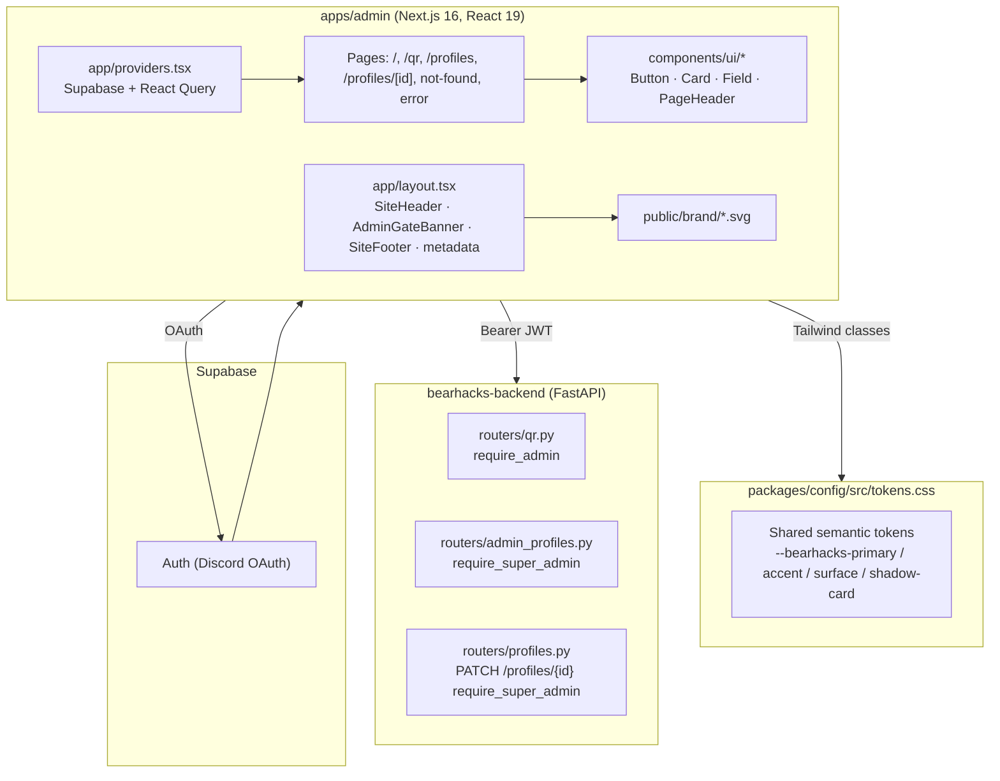

# BearHacks 2026 — `apps/admin` Production Polish

> Change record for the staff portal upgrade from PoC to production.
> Date: 2026-04-18.
> Source plan: `admin-portal-production-polish_b151830d`.
> Sister doc: [apps/me/docs/PRODUCTION_POLISH.md](../../me/docs/PRODUCTION_POLISH.md).

---

## 1. Summary

The admin portal (`bearhacks-web/apps/admin`) was lifted from a developer-facing
PoC into a production-ready staff console. Three things changed at once, all
visual / UX — **no functional behavior was modified**:

1. **Brand identity arrived.** The portal now matches the BearHacks 2026
   palette and logo set, sharing the same `Card`, `Button`, `Field`,
   `PageHeader`, `SiteHeader`, and `SiteFooter` primitives that ship with the
   participant portal.
2. **User-facing copy was de-jargoned.** Linear ticket IDs (`DEV-21`,
   `DEV-22`), JWT field names (`app_metadata.role`), backend route names
   (`require_admin`), and references to backend READMEs were stripped from any
   string an event volunteer might read. Auth-failure messages were rewritten
   in plain English.
3. **Production-style boundaries were added.** A friendly branded `not-found`
   page and an `error.tsx` boundary now catch unknown routes and render-time
   errors instead of dropping volunteers onto a black Next.js stack trace.

The data flow, role gates, FastAPI calls, structured logging, printer status
polling, search, reprint, delete, and PATCH operations are all bit-for-bit
identical to the previous build. Only the chrome around them changed.

---

## 2. End-to-end flow

```mermaid
flowchart LR
  signedOut[Signed-out '/'] -->|Discord OAuth| signedIn[Signed-in '/']
  signedIn --> qr['/qr — QR fulfillment']
  signedIn --> profiles['/profiles — directory']
  profiles --> profileEdit['/profiles/[id] — editor']
  any[Unknown URL] --> notFound[not-found.tsx]
  thrown[Render error] --> errorBoundary[error.tsx]
  notFound --> signedOut
  errorBoundary --> signedOut
```

---

## 3. Architecture: layered stack



---

## 4. Backend changes

**None.** The me-portal plan already shipped the `personal_url` column and
relaxed `PATCH /profiles/me` to `require_auth`. Admin endpoints continue to
require `require_admin` (QR routes) or `require_super_admin` (profile
directory + edits). This round was strictly frontend.

---

## 5. Design system

The admin portal now consumes the exact same tokens and primitives as `apps/me`,
so the two portals visually belong to the same product family.

### 5.1 Tokens (already shipped in `packages/config/src/tokens.css`)

Inherited from the `apps/me` rollout — see
[apps/me/docs/PRODUCTION_POLISH.md §5.1](../../me/docs/PRODUCTION_POLISH.md)
for the full token table. No new tokens were added in this round.

### 5.2 UI primitives (`apps/admin/components/ui/`)

Verbatim copies of the `apps/me` files. Same exports, same APIs:

| File              | Exports                                                         | Notes                                                    |
| ----------------- | --------------------------------------------------------------- | -------------------------------------------------------- |
| `button.tsx`      | `Button` (`primary` / `secondary` / `ghost`)                    | Honors `--bearhacks-touch-min`.                          |
| `card.tsx`        | `Card`, `CardHeader`, `CardTitle`, `CardDescription`            | Token-driven border + shadow + radius.                   |
| `field.tsx`       | `InputField`, `TextareaField`                                   | Label + input/textarea + hint/error slot, `useId`-based. |
| `page-header.tsx` | `PageHeader`                                                    | Optional back arrow with `router.back()` fallback.       |

### 5.3 Brand assets

Copied into `apps/admin/public/brand/`:

- `icon_black.svg` — favicon, in-card brand mark, 404 hero.
- `icon_white.svg` — header logo on the dark-blue chrome.
- `logo_long.svg` — reserved for future signed-out hero (not yet rendered).

### 5.4 Layout chrome

`apps/admin/components/site-header.tsx` and `site-footer.tsx` mirror the
participant portal. The header keeps the dark-blue background with the white
icon and a right-hand `Admin` label (in place of the participant portal's
`Networking`). The footer is identical.

`AdminGateBanner` remains mounted directly under the header so role state is
visible on every page.

---

## 6. Page-by-page changes

### 6.1 `app/layout.tsx`

- `metadata.title = "BearHacks 2026 Admin"`, with description, `icons`, and
  `openGraph` mirroring the participant portal.
- Body switched to `--bearhacks-surface-alt` page background and `flex-col`
  layout so the footer pins to the bottom.
- `{children}` is now wrapped in `<SiteHeader />` + `<AdminGateBanner />` +
  `<SiteFooter />`.

### 6.2 `app/page.tsx` (home)

- Removed the `"QR management (DEV-21)"` and `"Super-admin profiles (DEV-22)"`
  ticket suffixes and the bullet-list navigation.
- Now renders a `PageHeader` (`Admin` + plain-English subtitle) with a top-right
  **Sign out** ghost button when a user is signed in.
- Body is two branded `Card` tiles:
  - **QR fulfillment** → `/qr` — "Generate, search, reprint, and inspect attendee QR codes."
  - **Profile directory** → `/profiles` — "Search and edit attendee profiles (super-admin only)."
- No "via OAuth" or JWT-internal copy anywhere.

### 6.3 `components/admin-gate-banner.tsx`

Auth logic untouched — only copy and chrome moved.

- Sign-in CTA uses `<Button variant="primary">` instead of an underlined `<button>`.
- Replaced
  `"Signed in as <email> with role <role> against the FastAPI API."`
  with `"Signed in as {email}. Role: {roleLabel}."` (where `roleLabel` is a
  human label like `"Super admin"` instead of the raw `super_admin` string).
- Replaced
  `"Not detected as admin in JWT app_metadata.role… UI is for convenience only — the API enforces admin on every protected route."`
  with
  `"This account is not on the admin list yet — ask a super-admin to add you, then sign out and back in."`
- Discord OAuth, role detection, and disabled-provider toast logic are
  unchanged.

### 6.4 `app/qr/page.tsx`

Chrome and copy only — every query, mutation, and handler stays identical.

- Wrapped in `<PageHeader title="QR fulfillment" subtitle="…" backHref="/" showBack />`.
- Sections (`Printer server status`, `Generate batch`, `Print existing QR codes`,
  `Search by claim status`) are now `Card`s with `CardTitle` / `CardDescription`.
- Raw `<button>` / `<input>` / `<select>` swapped for `Button` and `InputField`
  primitives. The status filter retains a native `<select>` styled to match the
  field tokens.
- Replaced `"require_admin"` user-visible copy with `"Staff access required."`,
  and `"Admin role required"` toast strings with `"Admin access required."`.
- The `View` / `Reprint` / `Delete` row actions all use the `Button` primitive.
- The `View QR details` and `Admin logs` modals are now hosted in the same
  `Card` shell. JSON metadata renders inside a styled `<pre>` block instead of
  a raw `JSON.stringify` line, so the logs read as intentional power-user
  output.
- The in-page log buffer in `lib/structured-logging.ts` is untouched.

### 6.5 `app/profiles/page.tsx`

- Removed the rendered subtitle that named DEV-22, `app_metadata.role`,
  `SUPER_ADMINS`, and the backend README. The TS file header docstring stays
  for engineers; no end-user copy mentions backend internals.
- New subtitle: "Search and edit attendee profiles."
- Wrapped in `<PageHeader title="Profiles" backHref="/" showBack />`. Search
  input is now an `InputField`. The `Apply` action is a `Button variant="primary"`.
- Non-super-admin staff now see a friendly `Card` ("Super-admin access
  required. Ask a super-admin to grant your account access, then sign out and
  back in.") instead of the JWT-internal explanation.
- Edit links render as `Button`-styled CTAs inside a `Card`-wrapped table.

### 6.6 `app/profiles/[id]/page.tsx`

- Wrapped in `<PageHeader title="Edit profile" subtitle="…" backHref="/profiles" showBack />`.
- Form moved into a `Card`. All inputs are `InputField` / `TextareaField`. Save
  is a `Button variant="primary"`.
- The `"Super-admin JWT role required. The API will reject saves otherwise."`
  message was replaced with a branded `Card` reading `"Super-admin access
  required. Editing profiles is limited to super-admins. Ask a super-admin to
  grant your account access, then sign out and back in."`
- Save error toast says `"Super-admin access required."` instead of the
  JWT-flavoured original.

### 6.7 `app/not-found.tsx` (new)

Verbatim copy of the participant portal's 404. The "Go home" CTA returns to the
admin home (`/`) since this is the admin app.

### 6.8 `app/error.tsx` (new)

Verbatim copy of the participant portal's branded `Card`-based error boundary,
logging through `@bearhacks/logger`.

---

## 7. Infra-style fixes

### 7.1 `next.config.ts` — dev CSP

Mirrored the dev-only `connect-src` relaxation from `apps/me`:

```ts
const isDev = process.env.NODE_ENV !== "production";
const devConnectSrc = isDev
  ? " http://127.0.0.1:8000 http://localhost:8000 ws://localhost:3001 ws://127.0.0.1:3001"
  : "";
```

The websocket origins use port `3001` because admin's dev script runs on
`3001` (vs. `me`'s `3000`). Production CSP is unchanged: only
`https://api.bearhacks.com` and `https://*.supabase.co` are whitelisted.

### 7.2 `.env.local` — local API for dev

`NEXT_PUBLIC_API_URL` is set to `http://127.0.0.1:8000` so admin testing
exercises the local FastAPI. Must be flipped back to `https://api.bearhacks.com`
before deploy. **A `bun dev:admin` restart is required after changing
`NEXT_PUBLIC_API_URL` or `next.config.ts`** because Next.js bundles those at
startup.

---

## 8. File map of the change

```
bearhacks-web/apps/admin/
├── app/
│   ├── layout.tsx                            (modified — metadata, header/footer)
│   ├── page.tsx                              (rewritten — branded home)
│   ├── not-found.tsx                         (new)
│   ├── error.tsx                             (new)
│   ├── qr/page.tsx                           (modified — chrome + copy + primitives, no logic)
│   ├── profiles/page.tsx                     (modified — chrome + copy + primitives, no logic)
│   └── profiles/[id]/page.tsx                (modified — chrome + copy + primitives, no logic)
├── components/
│   ├── site-header.tsx                       (new — mirrors apps/me, label "Admin")
│   ├── site-footer.tsx                       (new — copied from apps/me)
│   ├── admin-gate-banner.tsx                 (modified — softer copy, uses Button primitive)
│   └── ui/
│       ├── button.tsx                        (new — copied from apps/me)
│       ├── card.tsx                          (new — copied from apps/me)
│       ├── field.tsx                         (new — copied from apps/me)
│       └── page-header.tsx                   (new — copied from apps/me)
├── public/brand/
│   ├── icon_black.svg                        (new — copied)
│   ├── icon_white.svg                        (new — copied)
│   └── logo_long.svg                         (new — copied)
├── next.config.ts                            (modified — dev CSP for 127.0.0.1:8000)
└── .env.local                                (modified — point at local API for dev)
```

---

## 9. Internally driven changes → mapping

The admin portal was not driven by founder asks (the `me` portal absorbed
those). This pass was driven by internal staff-experience asks observed during
the participant-portal polish: anything that would be embarrassing to demo to
a new event volunteer.

| Internal ask                                                                   | Where it landed                                                      |
| ------------------------------------------------------------------------------ | -------------------------------------------------------------------- |
| "Don't show Linear ticket IDs to volunteers"                                   | `app/page.tsx` (no DEV-21/DEV-22), `app/profiles/page.tsx` (no DEV-22) |
| "Don't expose JWT field names like `app_metadata.role` in user-facing copy"   | `components/admin-gate-banner.tsx`, `app/profiles/page.tsx`, `app/profiles/[id]/page.tsx` |
| "Don't reference backend route guards (`require_admin`) in user-facing copy"  | `app/qr/page.tsx`, `app/profiles/[id]/page.tsx`, all toast strings   |
| "Both portals should look like the same product"                              | Shared `SiteHeader` / `SiteFooter` / UI primitives / brand assets    |
| "Friendly 404 instead of the Next.js default"                                  | `app/not-found.tsx`                                                  |
| "Don't drop volunteers onto a render-time stack trace"                         | `app/error.tsx`                                                      |
| "Logs viewer should look like a tool, not a debug dump"                        | `app/qr/page.tsx` logs modal (Card shell + styled `<pre>`)           |
| "Local dev should hit the local FastAPI without CSP errors"                   | `next.config.ts` dev `connect-src` + `.env.local` API URL            |

---

## 10. Verification

| Check                                                                              | Result      |
| ---------------------------------------------------------------------------------- | ----------- |
| `bun run lint` (`apps/me` + `apps/admin`)                                          | ✅ Clean    |
| `bun run typecheck` (`apps/me` + `apps/admin`)                                     | ✅ Clean    |
| Cursor in-IDE lints on edited files                                                | ✅ Clean    |
| Admin endpoints unchanged (`require_admin` / `require_super_admin`)               | ✅ Confirmed |

### Manual smoke checklist

1. Anonymous → `/` shows the new branded shell, `AdminGateBanner` rendered with softened copy, single Discord sign-in CTA.
2. Sign in with non-admin Discord account → banner shows the friendly "ask a super-admin" copy, no JWT field names leaked.
3. Sign in with admin → home shows two cards (QR fulfillment, Profile directory). No DEV-21 / DEV-22 strings anywhere.
4. `/qr` → branded `<PageHeader>` with back arrow, `Field` / `Button` primitives, table inside `Card`; printer/search/reprint/delete/logs all behave identically to before.
5. `/profiles` → branded list, no `app_metadata.role` mentions; non-super-admin staff see the new soft `Card`.
6. `/profiles/{id}` → branded editor; PATCH still works for super-admin.
7. `/some-bogus-url` → branded 404 with founder copy.
8. Throw a render error in dev (`throw new Error('test')` inside a page temporarily) → `error.tsx` boundary renders.
9. Browser DevTools Network: `/qr`, `/profiles` requests go to `http://127.0.0.1:8000` (no CSP block).
10. Tap targets ≥ 44px (enforced by `--bearhacks-touch-min`); contrast ≥ AA on dark-blue/orange palette.

---

## 11. Out of scope (intentional non-goals)

- Any change to `lib/supabase-role.ts`, route gating, or FastAPI call shape.
- Functional behavior of `/qr` (printer status, search, reprint, delete, logs viewer).
- Functional behavior of `/profiles` and `/profiles/[id]` editor.
- `AdminGateBanner` auth logic (Discord OAuth stays — admin still uses Discord).
- Any backend changes (this round is frontend-only; backend was already done in the `me` plan).
- A signed-out hero with `logo_long.svg` (asset is shipped but not yet rendered — reserved for a future round).
